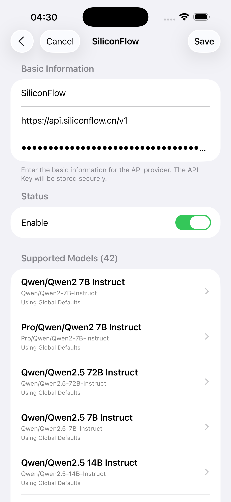
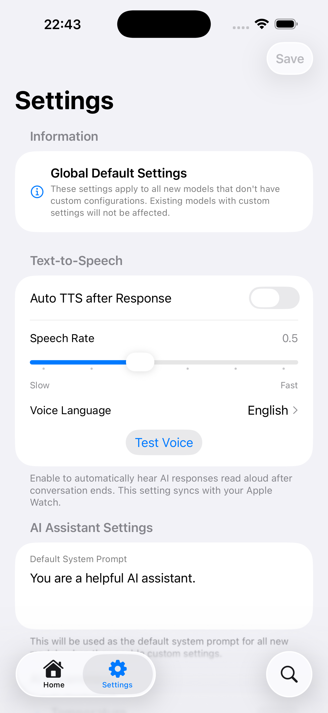

# LLM Wherever - Large Language Model Client for Apple Watch

A LLM client application designed specifically for Apple Watch, allowing you to chat with AI assistants anytime, anywhere on your watch.

## Features

### 📱 iPhone App
- **Smart API Configuration**: Add and manage multiple API providers (OpenAI, Claude, SiliconFlow, etc.)
- **Automatic Model Fetching**: Automatically fetch available model lists after entering API Key
- **Preset Templates**: Built-in configuration templates for popular APIs like OpenAI, Claude, SiliconFlow
- **Secure Storage**: API Keys are securely stored on local device
- **Real-time Sync**: Configuration automatically syncs to Apple Watch

### ⌚ Apple Watch App  
- **Ultimate Optimization**: Compact interface designed specifically for small screens
- **Liquid Glass Style**: Featuring Apple's latest translucent material design
- **Smart Conversations**: Support for multi-turn conversations with context preservation
- **Haptic Feedback**: Rich haptic feedback enhances interaction experience
- **Voice Input**: Support for voice-to-text input (system-level support)
- **Smooth Animations**: Smooth scrolling and transition animations
- **Quick Response**: Optimized network requests and error handling
- **Local Storage**: Chat history securely stored locally on the watch

## Screenshots

### 📱 iPhone App
<div align="center">

| Home | Provider Details | Settings |
|:---:|:---:|:---:|
|  |  |  |

</div>

### ⌚ Apple Watch App
<div align="center">

| Chat Interface | Chat History |
|:---:|:---:|
|  |  |

</div>

## Supported API Providers

- **OpenAI**: GPT-4, GPT-4o, GPT-3.5 Turbo
- **Claude**: Claude 3.5 Sonnet, Claude 3 Opus, Claude 3 Haiku  
- **SiliconFlow**: Qwen2.5-7B-Instruct, Qwen2.5-72B-Instruct, DeepSeek-V2.5
- **Custom APIs**: Support for other APIs compatible with OpenAI format

## Technical Architecture

### iOS App
- **SwiftUI**: Modern user interface framework
- **WatchConnectivity**: Data synchronization between iPhone and Apple Watch
- **UserDefaults**: Local data persistence
- **Async/Await**: Modern asynchronous processing

### watchOS App
- **Native SwiftUI**: Interface optimized specifically for watch
- **Memory Optimization**: Optimized for watch hardware limitations
- **Low Power Design**: Minimized battery consumption
- **Adaptive Layout**: Support for different sizes of Apple Watch

## How to Use

### 1. Configure API (iPhone)
1. Open the "LLM Wherever" app on iPhone
2. Tap "Add API Provider"
3. Select a preset provider (OpenAI, Claude, SiliconFlow) or create custom configuration
4. Enter API Key
5. Tap "Test Connection and Fetch Models" to automatically get available models
6. Configuration will automatically sync to Apple Watch

### 2. Start Conversation (Apple Watch)
1. Open "LLM Wherever" app on Apple Watch
2. Select API provider and model for first use
3. Input text or use voice input in the optimized chat interface
4. Experience smooth conversation interaction and haptic feedback
5. Long press send button to stop ongoing requests
6. Tap the gear icon in top right corner to change model anytime

## Design Philosophy

### Authentic Apple Ecosystem Experience
- Strictly follows Apple Human Interface Guidelines
- Uses native system UI components
- Maintains consistent interaction patterns with the system
- Supports Dark Mode and accessibility features

### Liquid Glass Design Style
- Translucent effects and material textures
- Smooth animations and transition effects
- Modern rounded corners and shadows
- Clear visual hierarchy with distinct layers

### User Experience First
- Simple and intuitive operation flow
- Quick response to interaction feedback
- Smart error handling and prompts
- Seamless synchronization experience between devices

## Privacy and Security

- **Local Storage**: All API Keys and chat records are stored only on user devices
- **End-to-End Encryption**: Data transmission between iPhone and Apple Watch is encrypted
- **No Cloud Service**: The app itself does not collect or store any user data
- **Transparent Communication**: Only communicates with API endpoints configured by users

## System Requirements

- **iPhone**: iOS 17.0+
- **Apple Watch**: watchOS 10.0+
- **Pairing Requirement**: Requires iPhone and Apple Watch to be paired
- **Network Connection**: Requires internet connection to access LLM APIs

## Development Notes

### Project Structure
```
LLM Wherever/
├── LLM Wherever/                 # iPhone App
│   ├── Models/                   # Data Models
│   ├── Managers/                 # Manager Classes
│   ├── Services/                 # Service Layer
│   ├── Views/                    # View Components
│   └── ContentView.swift         # Main View
└── LLM Wherever Watch App/       # Apple Watch App
    ├── Models/                   # Data Models (Shared)
    ├── Managers/                 # Manager Classes
    ├── Services/                 # Service Layer
    ├── Views/                    # View Components
    └── ContentView.swift         # Main View
```

### Key Components
- **APIProvider**: API provider data model
- **WatchConnectivityManager**: Inter-device communication management
- **LLMService**: API calling service
- **ChatMessage**: Message data model

## Reference Projects

This project references design concepts from the following open source projects:
- [humane.watch](https://github.com/Olivia-li/humane.watch) - AI assistant on Apple Watch
- [WatchGPT2](https://github.com/Sigil-Wen/WatchGPT2) - Locally running GPT2
- [PlaticaBot](https://github.com/JulieGibbs/PlaticaBot) - Cross-platform ChatGPT client

## License

MIT License - See LICENSE file for details

## Contributing

Issues and Pull Requests are welcome to improve this project!